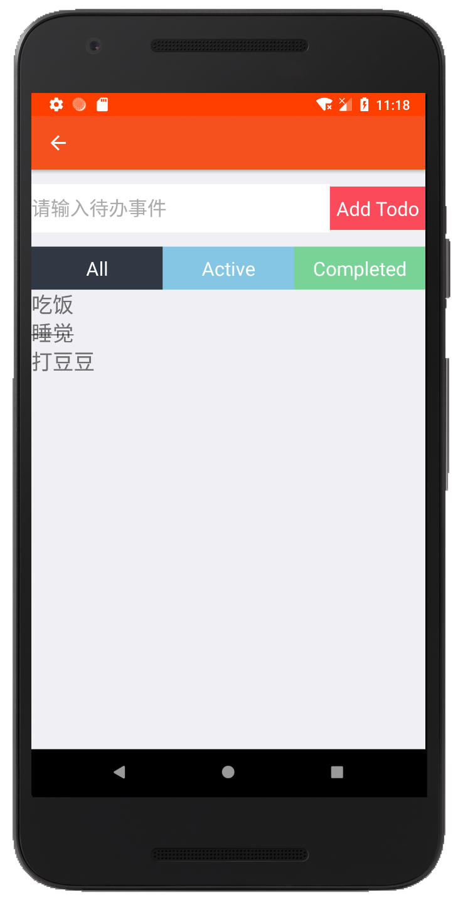

快捷地址：

> [react-navigation doc][react-navigation]

> [React Native Express ][React-Native-Express]

> [react-navigation-redux-helpers doc][react-navigation-redux-helpers]


### 介绍 Redux 中间件（Middleware）
还记得Redux的GIF嘛


我们需要稍微改变一下


正如你所看到的，这里还有一个概念：Middleware
#### 什么是Middleware
从[文档][Middleware]中看到：

```
    It provides a third-party extension point between dispatching an action, and the moment it reaches the reducer
```

简而言之，这是一个函数，在Action到达Reducer之前，将使用Action调用该函数。

在这个功能中，你可以让Action继续前进，你可以阻止它继续前进，或者你可以改变它，并把它发送给下一个。

#### 案例效果图
<figure class="half">
    
    
</figure>

[Middleware]: http://redux.js.org/docs/advanced/Middleware.html
[react-navigation]: https://reactnavigation.org/docs/getting-started.html
[React-Native-Express]: http://www.reactnativeexpress.com/
[react-navigation-redux-helpers]:https://github.com/react-navigation/react-navigation-redux-helpers


